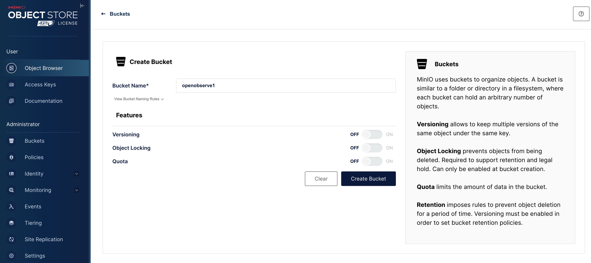

# Blog

## Pre-requisites

An existing Kubernetes cluster.

If you don't have an existing kubernetes cluster you use `kind (Kubernetes in Docker)` to create one.

```shell
kind create cluster
```

## Install minio

```shell
git clone https://github.com/minio/operator.git
```

Apply the resources to install MinIO

```shell
$ kubectl apply -k operator/resources
$ kubectl apply -k operator/examples/kustomization/tenant-lite
```

Verify MinIO is up and running. You can get the port of the MinIO console, in this case 9443.

```shell
$ kubectl -n tenant-lite get svc | grep -i console
myminio-console   ClusterIP   10.96.139.51   <none>        9443/TCP   70s
```

Set up kubernetes port forwarding: we chose port 39443 here for the host but this could be anything, just be sure to use this same port when accessing the console through a web browser.

```shell
$ kubectl -n tenant-lite port-forward svc/myminio-console 39443:9443
```

Forwarding from 127.0.0.1:39443 -> 9443
Forwarding from [::1]:39443 -> 9443

Access through the web browser using the following credentials

```shell
URL: https://localhost:39443
User: minio
Pass: minio123
```

Create a bucket called `openobserve1`



## Install OpenObserve

We will install OpenObserve using the official OpenObserve helm chart.

Let's get the `values.yaml` file first.

```shell
wget https://raw.githubusercontent.com/openobserve/openobserve-helm-chart/main/charts/openobserve/values.yaml
```

Now let's edit the `values.yaml` file to modify the following lines:

```yaml
auth:
  ZO_S3_ACCESS_KEY: "minio"
  ZO_S3_SECRET_KEY: "minio123"

config:
  ZO_S3_SERVER_URL: "https://myminio-hl.tenant-lite.svc.cluster.local:9000"
  ZO_S3_BUCKET_NAME: "openobserve1"
  ZO_S3_REGION_NAME: "us-east-1"
  ZO_S3_PROVIDER: "s3"
  ZO_S3_ALLOW_INVALID_CERTIFICATES: "true" # minio by default installs a self signed certificate
```

Now let's install OpenObserve using the helm chart.

```shell
helm repo add openobserve https://openobserve.github.io/openobserve-helm-chart
helm repo update

kubectl create namespace o2
helm -n o2 install openobserve openobserve/openobserve -f values.yaml
```

### Validate OpenObserve installation

```shell
kubectl get pods -n o2
```

```shell
NAME                              READY   STATUS    RESTARTS   AGE
openobserve-6f9f9f9f9f-4q2q2       1/1     Running   0          2m
```
